# 基础入门教程

## 前置基本能力

作为一名合格的程序员在学习任何编程语言前都必要熟练掌握两个基本技能：

* 一是基本的熟练键盘盲打，这是基本代码输入能力，打字速度太慢，代码输入效率就会太低。

打字速度提升可以通过金山打字通的每天坚持练习来提高。[金山打字通下载地址](https://www.51dzt.com/)

* 二是对英语的有一定的掌握程度，不一定是要能达到英语4-6级能力，但起码对常见的编程方面的用到的单词要熟练掌握。

* 英语水平的提高需要时间的积累，并非短期可以提高，靠谱的学习方法在于每天坚持学习一点点，慢慢提升单词量（每天把自己遇到的不认识单纯抄下来，通过金山词霸等类似学习软件学习读音和词意）和语感。

# 常用基础编程工具类软件

## Visual Studio Code 入门

VS Code是微软推出的新一代免费开源的现代化轻量级代码编辑器，支持几乎所有主流的开发语言的语法高亮、智能代码补全、自定义快捷键、括号匹配和颜色区分、代码片段、代码对比 Diff、GIT命令 等特性，支持插件扩展，并针对网页开发和云端应用开发做了优化。VS Code跨平台支持 Win、Mac 以及 Linux，运行流畅，可以算得上是微软的难得良心之作。

* VS Code 官方网址 [https://code.visualstudio.com/](https://code.visualstudio.com/)

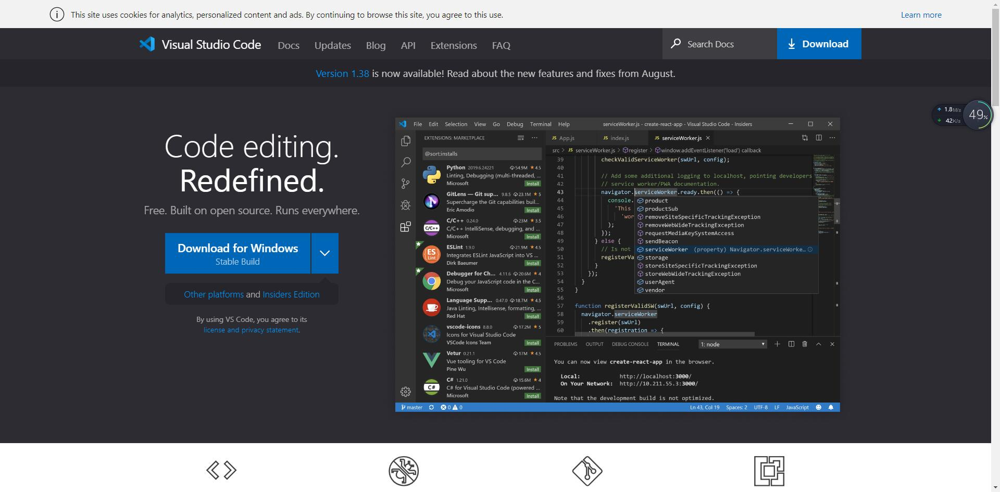

## VS Code 基本功能介绍

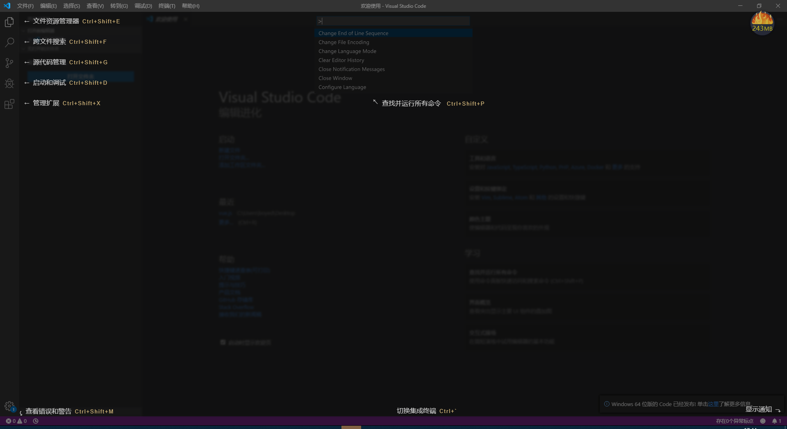

## 常用快捷键

Ctrl + Shift + E 资源管理器

Ctrl + Shift + F 搜索

Ctrl + Shift + G 源代码管理器

Ctrl + Shift + D 调试

Ctrl + Shift + X 插件扩展

F1 或 Ctrl+ Shift + p 打开命令面板

Shift + Alt + F 代码格式化

Ctrl+ F 查找

Ctrl+ H 查找替换

Ctrl+ N 新建文件

Ctrl+ S 保存

Alt + ↑ 或 Alt + ↓ 上下移动一行

Shift + Alt + ↑ 或 Shift + Alt + ↓ 向上向下复制一行

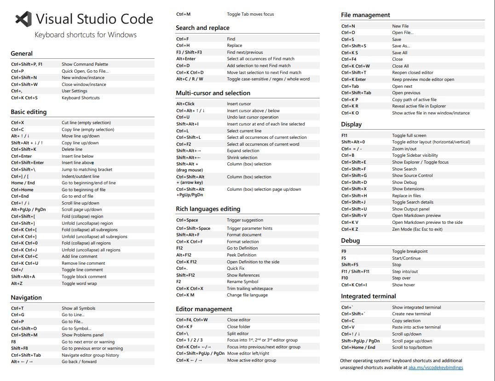

## 扩展插件入门

扩展插件的查找与安装：

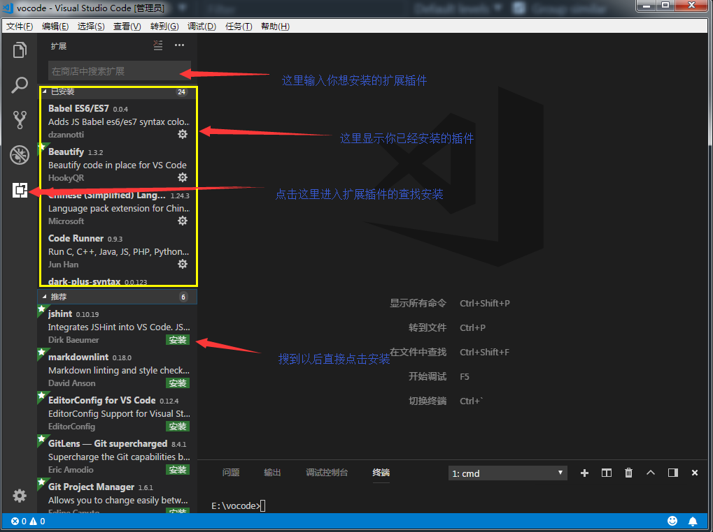

## 常用的插件

* 中文语言包 Chinese (Simplified) Language Pack for Visual Studio Code

* MarkDown预览增强 Markdown Preview Enhanced

* 代码拼写检查器 Code Spell Checker

* 浏览器预览增强 open in browser

* 检查英文语句中的中文符号 sneak mark

* VS Code图标 vscode-icons

* 格式化代码工具 beautify

* HTML代码提示器 HTML Snippets

* CSS样式提升器 HTML CSS Support

* 各种皮肤主题 例如：One Dark Pro，Bimbo，Atom One Dark Theme


## MarkDown

>Markdown是一种**轻量级**可以使用普通文本编辑器编写的标记语言，通过简单的标记语法，它可以使普通文本内容具有一定的格式。同时MarkDown文档可以输出为HTML,PDF等多种各种文件。

### 基本语法

* 标题
  
> 标题能显示出文章的结构。行首插入1-6个 # ，每增加一个 # 表示更深入层次的内容，对应到标题的深度由 1-6 阶。


``` markdown
# 一级标题
## 二级标题
### 三级标题
#### 四级标题
##### 五级标题
###### 六级标题
``` 
 8217312893
* 加粗文本
**文本加粗**

``` markdown
**文本加粗**
``` 

* 斜体
  
  *斜体文字*
``` markdown
   *斜体文字*
``` 

* 下划线
  
  <u>下划线</u>
``` markdown
   <u>下划线</u>
```   

* 删除线
  ~~删除线~~
``` markdown
   ~~删除线~~ 
```

* 分割线
  下面是一条分割线
  ***

 ``` markdown
    下面是一条分割线
    ***
 ```

 * 引用文本
> 这是一段介绍Markdown语法的文字。
``` markdown 
> 这是一段介绍Markdown语法的文字。
```

* 符号列表或数字列表
   * 圆点符号
   1. 数字序列
   2. 数字序列
   
``` markdown
    * 圆点符号
    1. 数字序列
    2. 数字序列
```

==高亮==

* 添加代办事项

 ~~谁是最好的语言~~

* [ ] javascript
* [ ] JavaScript
* [ ] PHP
* [ ] C#
* [x] Markdown
``` markdown
* [ ] JavaScript
* [ ] PHP
* [ ] C#
* [x] Markdown
```

* 插入链接
  [VSCode官网](https://code.visualstudio.com/)
  [MarkDown百度百科](https://baike.baidu.com/item/markdown/3245829?fr=aladdin)

``` markdown
    [VSCode官网](https://code.visualstudio.com/)

    [MarkDown百度百科](https://baike.baidu.com/item/markdown/3245829?fr=aladdin)
```

* 插入图片
>支持嵌入网络图片或者直接拖入本地图片，其中本地图片格式支持 jpg、png 和 gif。

  

``` markdown
    
```

* 插入表格
  
| 帐户类型 | 免费帐户 | 标准帐户 | 高级帐户 |
| --- | --- | --- | --- |
| 帐户流量 | 60M | 1GB | 10GB |
| 设备数目 | 2台 | 无限制 | 无限制 |
| 当前价格 | 免费 | ￥8.17/月 | ￥12.33/月|

```markdown
    | 帐户类型 | 免费帐户 | 标准帐户 | 高级帐户 |
    | --- | --- | --- | --- |
    | 帐户流量 | 60M | 1GB | 10GB |
    | 设备数目 | 2台 | 无限制 | 无限制 |
    | 当前价格 | 免费 | ￥8.17/月 | ￥12.33/月|
```

***
* 插入代码块
  
> 这个功能是为了程序员量身定做的

```html
    <!DOCTYPE html>
    <html lang="en">
    <head>
        <meta charset="UTF-8">
        <meta name="viewport" content="width=device-width, initial-scale=1.0">
        <meta http-equiv="X-UA-Compatible" content="ie=edge">
        <title>Document</title>
    </head>
    <body>
        
    </body>
        </html>
```

``` html
 <!DOCTYPE html>
    <html lang="en">
    <head>
        <meta charset="UTF-8">
        <meta name="viewport" content="width=device-width, initial-scale=1.0">
        <meta http-equiv="X-UA-Compatible" content="ie=edge">
        <title>Document</title>
    </head>
    <body>
        
    </body>
        </html>
```

### MarkDown编辑工具

 [VSCode](https://code.visualstudio.com/)

 [Typora](https://www.typora.io/)

 [印象笔记](https://help.yinxiang.com/)

 [Cmd Markdown 作业部落](https://www.zybuluo.com/cmd/)

 #
 ## Git简介
 ## [Git下载地址](https://git-scm.com/)
 Git是什么？Git是一个免费的开源 分布式版本控制系统，旨在快速高效地处理从小型到大型项目的所有事务。

 git基本原理：

 git版本管理工具，有3个工作区：
 
 1.工作目录

2.暂存区--存放工作中更改的文件，避免项目代码丢失。

3.代码仓库-----当开发功能足够成为一个版本时，提交到仓库。其实就是将暂存区中代码复制一份存储到代码仓库中。

Git的基本工作流程

 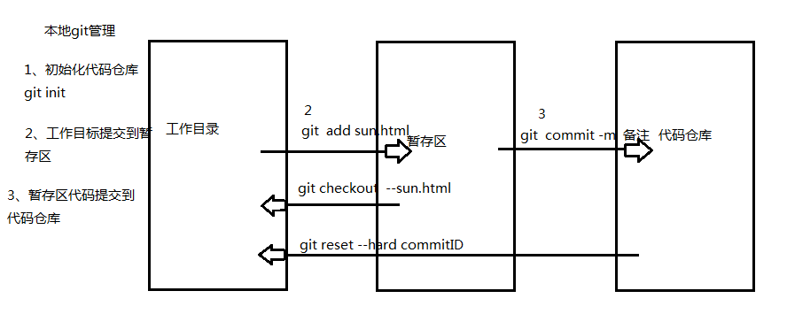

 ## git bash 命令行模式的基本特点：

* 简洁，迅速，高效

* git bash 基础命令

pwd (print working directory) 查看当前所在路径--绝对路径

cd(change directory) 切换目标

mkdir(make directory) 创建目录

touch 创建文件

ls(list) 查看当前目录下的内容

cat 查看文件内容（一次性将内容全部显示）

clear 清屏

q(quit) 退出

Git有两种操作界面，命令行模式和图形界面模式，我们平常主要使用的是命令行模式

* Git Bash 命令行模式是使用的Linux系统命令行，所有和Window系统有一些差异，例如上图中 /c/Users 这个路径就和Window系统的下现实 C:\Users 路径显示略有不同，但实际上都是显示的同一个目录路径，实际上 /c/Users = C:\Users 。

[Git教程](https://git-scm.com/book/zh/v2/%E8%B5%B7%E6%AD%A5-%E5%85%B3%E4%BA%8E%E7%89%88%E6%9C%AC%E6%8E%A7%E5%88%B6)

## GitHub 简介

GitHub是什么？Github是一个基于it的代码托管平台，Github 由Chris Wanstrath, PJ Hyett 与Tom Preston-Werner三位开发者在2008年4月创办。这个星球上最流行的开源托管服务。目前已托管上百万的git项目，很多知名开源项目迁入GitHub，比如Ruby on Rails、jQuery、Ruby、Erlang/OTP；近年流行的开源库往往在GitHub首发，例如：BootStrap、Node.js、CoffeScript等。

* 注册GitHub账号 

[GitHub网址](https://github.com/)

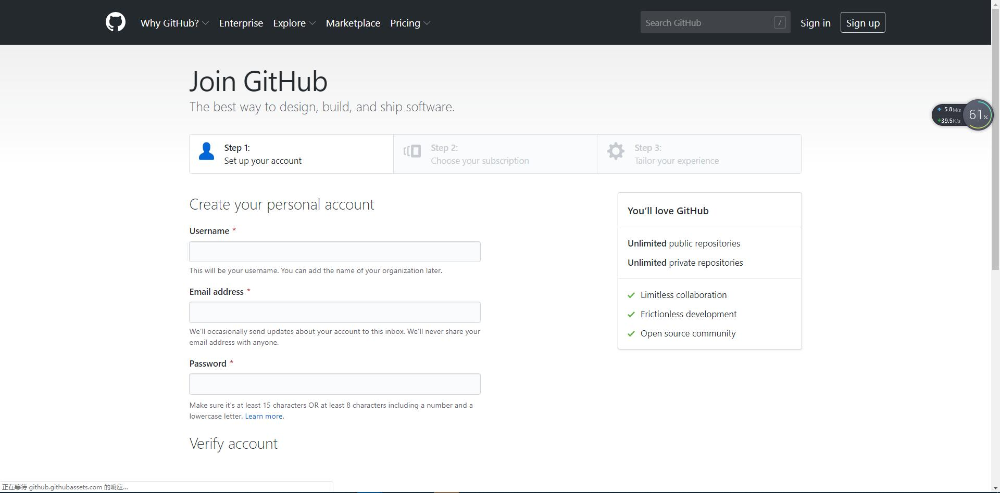

* 首先我们登陆GitHub官网按照提示一步一步申请免费的账号，并且初始化仓库。
* 然后打开Git Bash 在命令行模式下通过cd 命令进入对应目录，在下图我进入的桌面(Desktop)目录

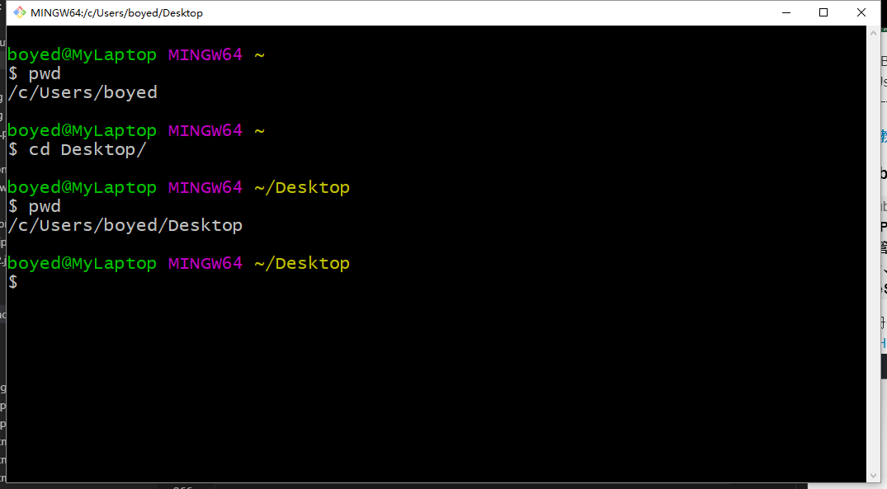

* 我们首先设置对应GitHub账号用户名和邮件

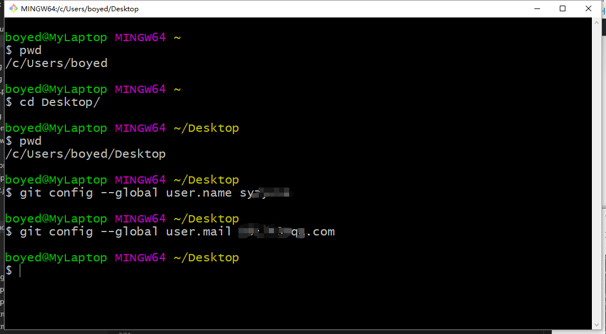

git config --global user.name 你自己的注册名

git config --global user.email 你自己的注册邮件

* 从远程GitHub仓库克隆刚刚初始化的项目

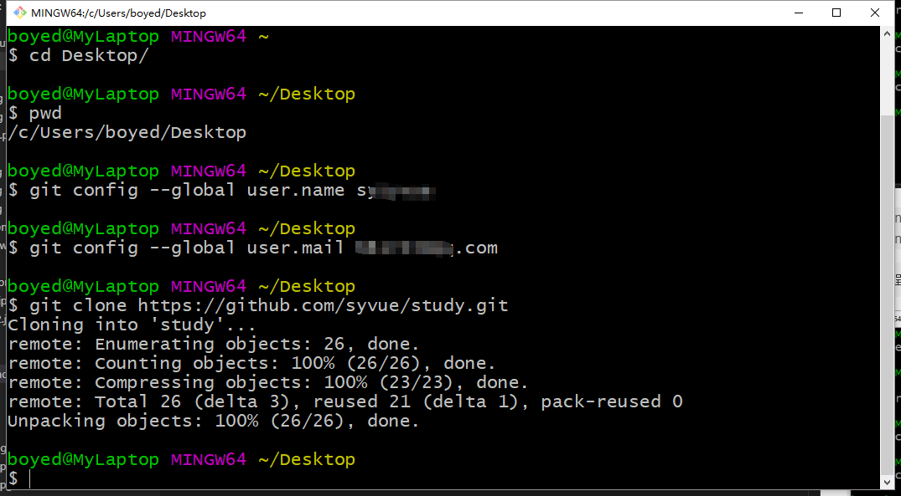

git clone [https://github.com/](https://github.com/)你自己的仓库地址

* 进入克隆目录，然后当完成对文件的编辑保存好之后，我们先将修改后的文件添加到缓存区。
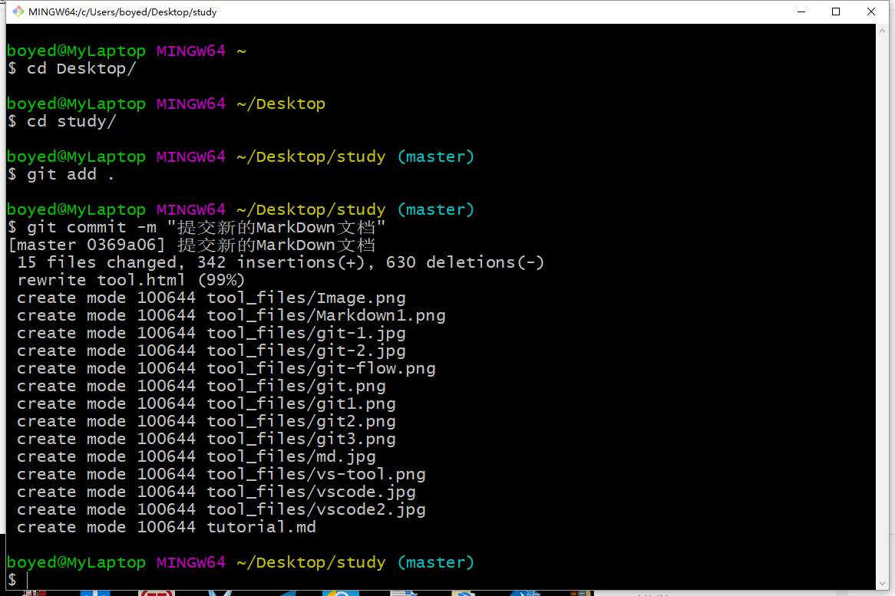

git add .

git commit -m "代码提交的信息"

* 将提交的结果推送代码到远程GitHub仓库(（在这个过程，系统会要求我们输入远程GitHub的账号和密码，按提示输入即可，由于还原系统的问题，我们就不使用SSH方式登录，但是在后面我们会在单独介绍SSH免密登录）。)

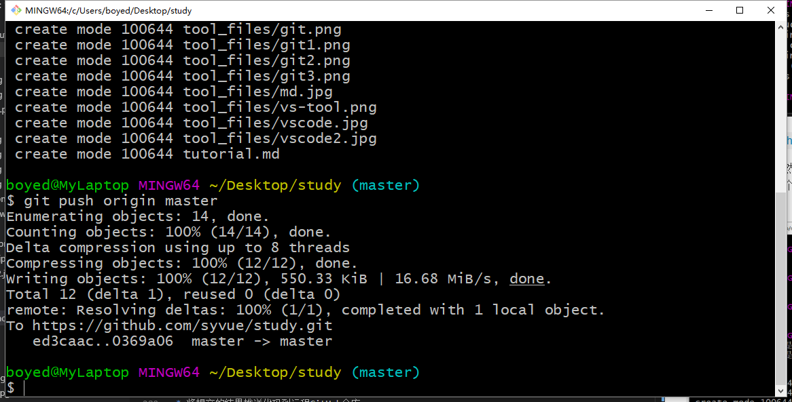

git push origin master